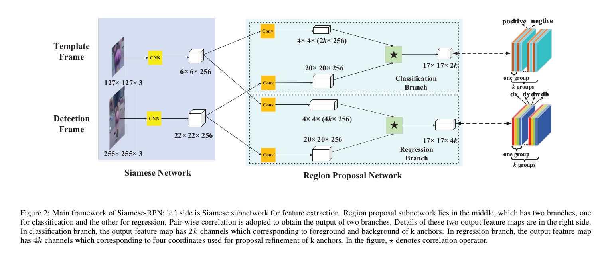
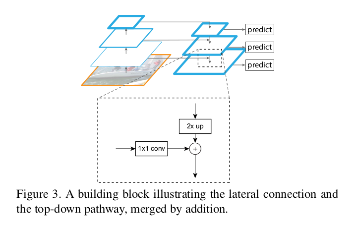
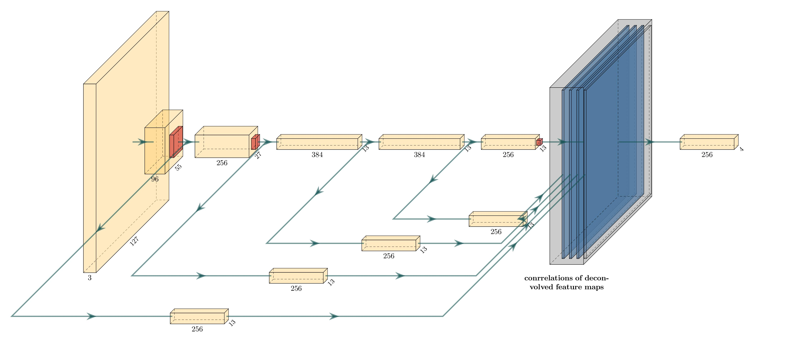
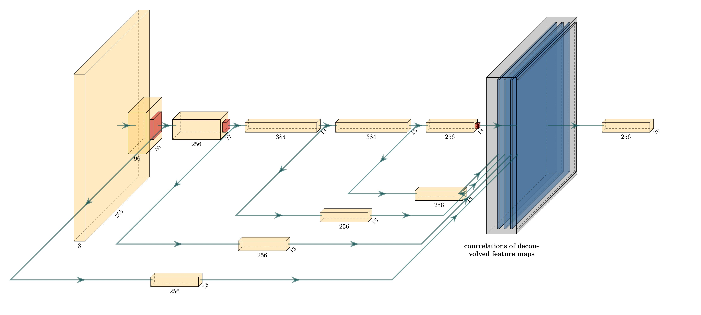

# SiameseRPN with FPN

This project is mainly based on <a href="https://github.com/HelloRicky123/Siamese-RPN" >HelloRicky123/Siamese-RPN</a>. What I've done is just add a Feature Pyramid Network method to the original AlexNet structures.

For more details about siameseRPN please refer to the paper : [High Performance Visual Tracking with Siamese Region Proposal Network](http://openaccess.thecvf.com/content_cvpr_2018/papers/Li_High_Performance_Visual_CVPR_2018_paper.pdf) by Bo Li, Junjie Yan,Wei Wu, Zheng Zhu, Xiaolin Hu.

For more details about Feature Pyramid Network please refer to the paper: <a href="https://openaccess.thecvf.com/content_cvpr_2017/papers/Lin_Feature_Pyramid_Networks_CVPR_2017_paper.pdf">Feature Pyramid Network for Object Detection</a> by Tsung-Yi Lin, Piotr Dollár, Ross Girshick, Kaiming He, Bharath Hariharan, and Serge Belongie.


## Networks

- Siamese Region Proposal Networks

  

- Feature Pyramid Networks

  

- SimaeseRPN+FPN

  - Template Branch
  
    
  
  - Detection Branch
  
    

## Results

This project can get 0.618 AUC on OTB100, which also achieves  overall 1.3% progress than the performance of baseline Siamese-RPN. Additionally, based on the ablation study results, it also shows that it can achieve robust performance different operating systems and GPUs.


## Data preparation

I only use pre-trained models to finish my experiments，so here I would post the testing dataset OTB100 I get from http://cvlab.hanyang.ac.kr/tracker_benchmark/

If you don't want to download through the website above, you can just download: https://pan.baidu.com/s/1vWIn8ovCGKmlgIdHdt_MkA key: p8u4

For more details about OTB100 please refer to the paper: <a href="https://faculty.ucmerced.edu/mhyang/papers/pami15_tracking_benchmark.pdf">Object Tracking Benchmark</a> by Yi Wu, Jongwoo Lim, Ming-Hsuan Yang.


## Train phase

I didn't do any training but I still keep the baseline training method in my project. So if you have VID dataset or youtube-bb dataset, I would just post the steps of training here

Create dataset:

 ```shell
 python bin/create_dataset_ytbid.py --vid-dir /PATH/TO/ILSVRC2015 --ytb-dir /PATH/TO/YT-BB --output-dir /PATH/TO/SAVE_DATA --num_threads 6
 ```

Create lmdb:

```shell
python bin/create_lmdb.py --data-dir /PATH/TO/SAVE_DATA --output-dir /PATH/TO/RESULT.lmdb --num_threads 12
```

Train: 

```shell
python bin/train_siamrpn.py --data_dir /PATH/TO/SAVE_DATA
```


## Test phase

If want to test the tracker, please first change the project path:

```python
sys.path.append('[your_project_path]')
```

And then choose the combinations of different layers I putted in the net/network.py

then input your model path and dataset path to run:

```shell
python bin/test_OTB.py -ms [your_model_path] -v tb100 -d [your_dataset_path]
```


## Environment

I've exported my anaconda and pip environment into /env/conda_env.yaml and /env/pip_requirements.txt

if you want to use it, just run the command below accordingly

for anaconda: 

```shell
conda create -n [your_env_name] -f conda_env.yaml
```

for pip:

```shell
pip install -r requirements.txt
```


## Model Download

Model which the baseline uses: https://pan.baidu.com/s/1vSvTqxaFwgmZdS00U3YIzQ keyword: v91k

Model after training 50 epoch: https://pan.baidu.com/s/1m9ISra0B04jcmjW1n73fxg keyword: 0s03


## Experimental Environment

(1)

DELL-Precision-7530

OS: Ubuntu 18.04 LTS
CPU: Intel(R) Core(TM) i7-8750H CPU @ 2.20GHz

Memory: 2*8G DDR4 2666MHZ

GPU: Nvidia Quadro P1000


(2)

HP OMEN

OS: Windows 10 Home Edition

CPU: Intel(R) Core(TM) i7-9750H CPU @ 2.6GHz

Memory: 2*8G DDR4 2666MHZ 

GPU: Nvidia Geforce RTX2060


## Optimization

**On Ubuntu and Quadro P1000**

- AUCs with model siamrpn_38.pth

| Layers                     | Results(AUC)                 |
| -------------------------- | ---------------------------- |
| baseline                   | 0.610                        |
| <font color=red>2+5</font> | <font color=red>0.618</font> |
| 2+3+5                      | 0.607                        |
| 2+3+4+5                    | 0.611                        |

- AUCs with model siamrpn_50.pth

| Layers                     | Results(AUC)                 |
| -------------------------- | ---------------------------- |
| baseline                   | 0.600                        |
| <font color=red>2+5</font> | <font color=red>0.605</font> |
| 2+3+5                      | 0.594                        |
| 2+3+4+5                    | 0.605                        |

**On Windows 10 and Nvidia Geforce RTX2060**

- AUCs with model siamrpn_38.pth

| layers                     | Results(AUC)                 |
| -------------------------- | ---------------------------- |
| baseline                   | 0.610                        |
| <font color=red>2+5</font> | <font color=red>0.617</font> |
| 2+3+5                      | 0.607                        |
| 2+3+4+5                    | 0.612                        |

- AUCs with model siamrpn_50.pth

| Layers                     | Results(AUC)                 |
| -------------------------- | ---------------------------- |
| baseline                   | 0.597                        |
| <font color=red>2+5</font> | <font color=red>0.606</font> |
| 2+3+5                      | 0.597                        |
| 2+3+4+5                    | 0.605                        |


## Reference

[1] B. Li, J. Yan, W. Wu, Z. Zhu, X. Hu, High Performance Visual Tracking with Siamese Region Proposal Network, in*Proceedings of the IEEE Conference on Computer Vision and Pattern Recognition (CVPR)*, 2018, pages 8971-8980.

[2] T. Lin, P. Dollar, R. Girshick, K. He, B. Hariharan, S. Belongie, in *Proceedings of the IEEE Conference on Computer Vision and Pattern Recognition (CVPR)*, 2017, pages 2117-2125.

[3] Y. Wu, J. Lim, M. Yang, "Object Tracking Benchmark", in *IEEE Transactions on Pattern Analysis and Machine Intelligence*, 2015, pages 1834-1848.

